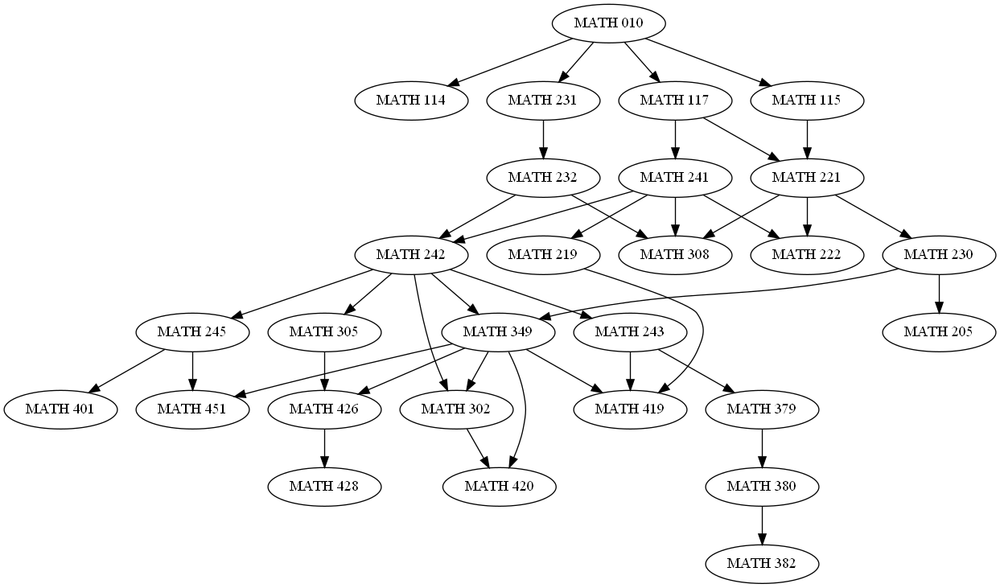

# Title of Your Project

**CISC320 Spring 2023 Lesson 14 - Graph Applications**

Group Members:
* Leon Giang (philong@udel.edu)
* Second member (email)
* Third member (email)
* Fourth member (email)

Creating various related graphs for use in creative problem-solving algorithms utilizing python's popular networkx library.

## Installation Code

```sh
$> pip install networkx
```

## Python Environment Setup

```python
import networkx as nx
```

# BFS - Finding Courses Given a Prerequisite

**Informal Description**: BFS problem that enables you to find all the courses which list your given course as a prereq. Essentially, you can find what courses you can now take given you have taken the specified course.

> **Formal Description**: Given a Course ID, find all of its direct children.
>  * Input: A Course ID, with a space between the course and its number, and an adjacency dictionary that lists each node as keys and their parents as values.
>  * Output: The direct children of the Course ID. If there are no children, returns a message informing the user that no courses list the given course as a prereq. If the node does not exist, returns a networkx error indicating that the node could not be found.

**Graph Problem/Algorithm**: [BFS]


**Setup code**:

```python
def build_graph_from_dict(parents_dict):
    # Create an empty directed graph
    graph = nx.DiGraph()

    # Add all nodes to the graph
    nodes = parents_dict.keys()
    graph.add_nodes_from(nodes)

    # Add edges between nodes and their parents
    for node, parents in parents_dict.items():
        for parent in parents:
            graph.add_edge(parent, node)

    return graph

parents_dict = {
    "MATH 010" : [],
    "MATH 114" : ['MATH 010'],
    "MATH 115" : ['MATH 010'],
    "MATH 221" : ['MATH 115', 'MATH 117'],
    "MATH 222" : ['MATH 221', 'MATH 241'],
    "MATH 230" : ['MATH 221'],
    "MATH 205" : ['MATH 210', 'MATH 230'],
    "MATH 349" : ['MATH 230', 'MATH 242'],
    "MATH 302" : ['MATH 242', 'MATH 349', 'MATH 351'],
    "MATH 420" : ['MATH 302', 'MATH 349', 'MATH 350'],
    "MATH 419" : ['MATH 219', 'MATH 243', 'MATH 349', 'MATH 350'],
    "MATH 426" : ['MATH 305', 'MATH 351', 'MATH 349'],
    "MATH 428" : ['MATH 426', 'MATH 353'],
    "MATH 451" : ['MATH 349', 'MATH 245'],
    "MATH 308" : ['MATH 221', 'MATH 232', 'MATH 241'],
    "MATH 117" : ['MATH 010'],
    "MATH 241" : ['MATH 117'],
    "MATH 219" : ['MATH 241'],
    "MATH 242" : ['MATH 241', 'MATH 232'],
    "MATH 243" : ['MATH 242'],
    "MATH 379" : ['MATH 243'],
    "MATH 380" : ['MATH 379'],
    "MATH 382" : ['MATH 380'],
    "MATH 245" : ['MATH 210', 'MATH 242'],
    "MATH 401" : ['MATH 245'],
    "MATH 305" : ['MATH 242'],
    "MATH 231" : ['MATH 010'],
    "MATH 232" : ['MATH 231'],
}

G = build_graph_from_dict(parents_dict)

```

**Visualization**:



**Solution code:**

```python
def find_direct_children(graph, source):
    # Create a BFS tree starting from the source node
    bfs_tree = nx.bfs_tree(graph, source, depth_limit=1)
    
    # Creates an empty list to contain the children of the node
    children = []
    
    # Loops through every node in bfs_tree. Since the max depth is 1, every node is the child of the source.
    for node in bfs_tree:
        if node != source:
            children.append(node)
    
    # If the source node has no children, return a message
    if not children:
        return "There are no other courses that have the one you entered as a prereq!"
    return children
```

**Output**

```
Please enter a course. You must enter a course ID following the example format: "MATH 242"
The BFS algorithm will determine what courses you can take once you have completed the course you entered: MATH 242
Here are the courses you can take now:
['MATH 349', 'MATH 302', 'MATH 243', 'MATH 245', 'MATH 305']
```

**Interpretation of Results**: Given that you have taken MATH 242, the courses that you can now take are MATH 349, MATH 302, MATH 243, MATH 245, and MATH 305. These courses list MATH 242 as a prereq and, now that you have taken MATH 242, you are now able to enroll in these courses.

